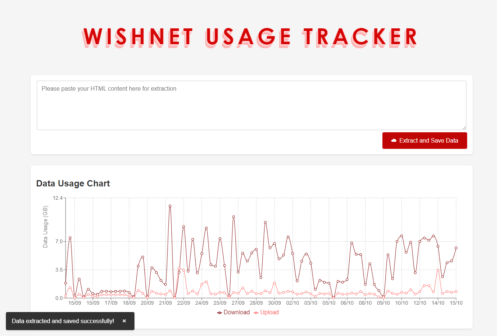

# Wishnet Usage Tracker



**Wishnet Usage Tracker** is a powerful web application designed to help users efficiently track their data usage. With a user-friendly interface and insightful visualizations, you can monitor your download and upload activities over time, making it easier to manage your data consumption.

## Table of Contents

- [Features](#features)
- [Technologies Used](#technologies-used)
- [Getting Started](#getting-started)
- [Available Scripts](#available-scripts)
- [Usage](#usage)
- [Contributing](#contributing)

## Features

- **Data Visualization**: Interactive charts powered by Recharts to visualize data usage trends over time.
- **HTML Data Extraction**: Easily extract data from HTML tables and save it to your backend.
- **Responsive Design**: Optimized for both desktop and mobile devices, ensuring a seamless user experience.
- **User Notifications**: Snackbar notifications provide real-time feedback to users during data extraction and saving processes.

## Technologies Used

- **React**: A JavaScript library for building user interfaces, enabling a component-based architecture.
- **Recharts**: A composable charting library built on React components, providing flexible and customizable charts.
- **CSS Variables**: For consistent theming and styling across the application.
- **Fetch API**: For making HTTP requests to the backend, facilitating data retrieval and submission.
- **Express**: A minimal and flexible Node.js web application framework for building the backend server.
- **Concurrently**: To run both the frontend and backend servers simultaneously during development.

## Getting Started

To get a local copy up and running, follow these steps:

1. **Clone the repository**:
   ```bash
   git clone https://github.com/SouravFrank/Wishnet-Usage-Tracker.git
   cd wishnet-usage-tracker
   ```

2. **Install dependencies**:
   ```bash
   npm install
   ```

3. **Run the application**:
   ```bash
   npm start
   ```
   Open [http://localhost:3000](http://localhost:3000) to view it in your browser.

## Available Scripts

In the project directory, you can run:

### `npm start`

Runs the app in development mode. The page will reload when you make changes.

### `npm run build`

Builds the app for production to the `build` folder. Your app is ready to be deployed!

### `npm run eject`

**Note: This is a one-way operation. Once you eject, you can't go back!**

If you aren't satisfied with the build tool and configuration choices, you can eject at any time.

## Usage

1. **Extract Data**: Paste your HTML content into the provided textarea and click "Extract and Save Data".
2. **View Data Usage**: Monitor your data usage trends through the interactive chart, which updates in real-time based on the extracted data.

## Contributing

Contributions are welcome! Please follow these steps:

1. Fork the repository.
2. Create your feature branch (`git checkout -b feature/AmazingFeature`).
3. Commit your changes (`git commit -m 'Add some AmazingFeature'`).
4. Push to the branch (`git push origin feature/AmazingFeature`).
5. Open a pull request.

----

### Engage with Us!

We encourage you to engage with the project by providing feedback, reporting issues, or suggesting features. Your contributions help us improve the application and make it more useful for everyone!